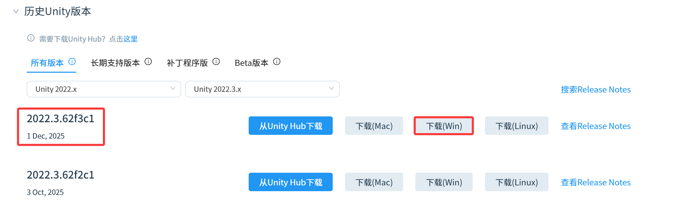

## 第一步：下载 Unity Hub

### 1. Unity Hub 国际版

https://github.com/NoUnityCN/NoUnityCN/issues/63 中 NoUnityCN 的作者给出了一个下载站链接，点击输入密码即可

### 2. Unity Hub 国内版

https://unity.cn/tuanjie/releases?u_release_type=full 选择 Windows 下载即可

Unity hub 的版本不是很重要，相对新的版本即可

## 第二步：下载 Unity Editor



https://unity.cn/tuanjie/releases?u_release_type=full 下拉找到历史 Unity 版本，经过尝试似乎从 Unity Hub 下载并不可行，点击 Windows 下载，注意保存在 Unity 目录下，与 Unity/Hub 同级

## 第三步：成为 collaborator

告诉我你的 github username 或者邮箱，我邀请你后你即可成为协作者，此后你也可以直接对本仓库进行操作

## 第四步：同步当前进度

在 powershell/cmd/bash 上运行 

`git clone https://github.com/allwayso/CookingSimulator.git`

此后每次编辑之前，先运行以下指令同步进度：

```bash
    git checkout dev
    git pull origin dev
```

## 第五步：查看文档

docs目录下的各个文档，如果你不想亲自看，让ai先看一遍：

- mvp.md规定了最小产品的功能范围，当前优先完成该项目中的功能
- todolist规定了当前任务中以及完成的部分和尚未完成的部分
- 项目开发依据基本概括了整个游戏的流程，是原本各个计划书的总结版本

> 如果你也使用Codex，dev分支下已经有AGNET.md，它规定了agent的行为，如果你使用其他agent,也可以借鉴其中的内容配置CLAUDE.md等系统提示词

## 第六步：开发

main分支为稳定分支，dev分支为总开发分支

不可直接在dev/main分支上进行修改，先创建一个新的本地分支来开发，确定功能完备后提出pr，请求合并到dev分支上,流程如下：

```bash
  # 开发前先同步！再次强调！
  git checkout dev
  git pull origin dev

  # 创建功能分支
  git checkout -b feat/your-feature-name

  # 开发完成后
  git status                    # 看看改了哪些文件
  git add <具体文件>              # 而不是 git add .（如果希望使用add . 先配置.gitignore，避免push上不必要的文件）
  git commit -m "feat: 描述你做了什么"

  # 推送前再同步一次（防止别人已经合了东西）
  git checkout dev
  git pull origin dev
  git checkout feat/your-feature-name
  git merge dev                  # 或 git rebase dev
  # 解决冲突（如有）
```

注意： Base 分支记得选择 dev（而不是 main），将自己的功能分支合并到 dev。

代码评审与合并： 你或者其他组员在 GitHub 的 Pull Requests 页面检查代码，经过另外至少一个人 code review 后，点击 Merge pull request 合并进 dev 分支。
